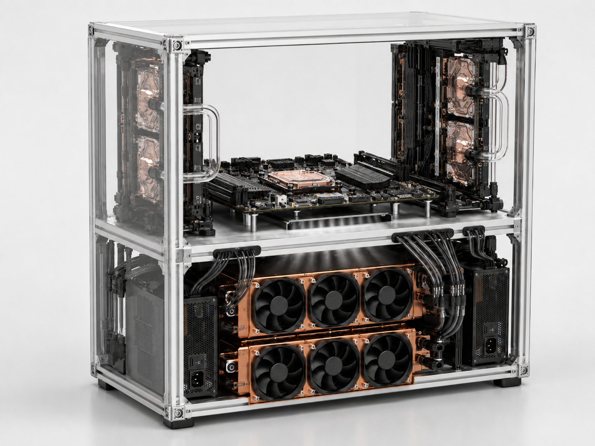
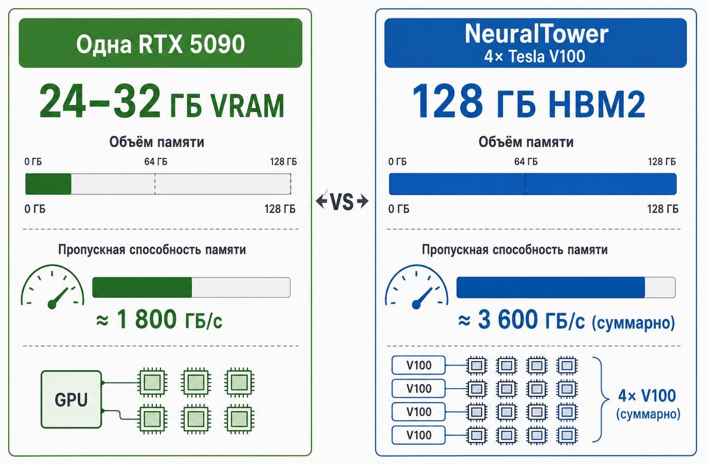
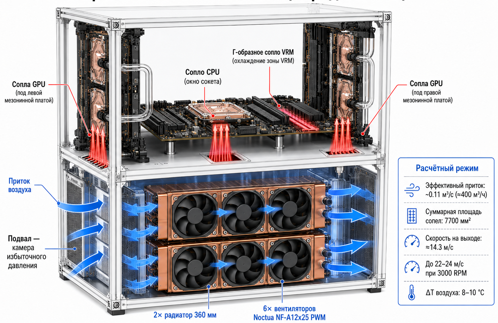
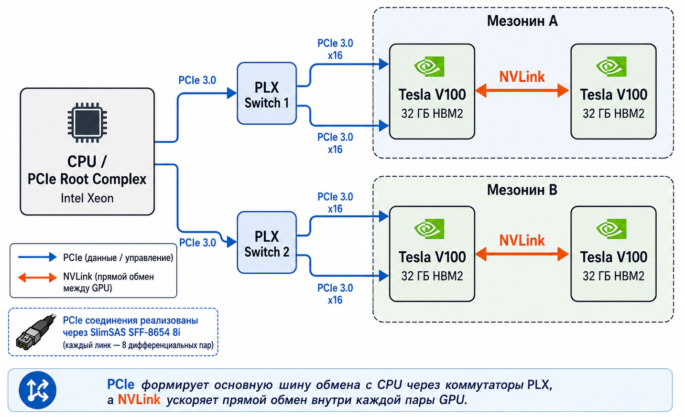

# NeuralTower: Проектирование настольного вычислительного узла на базе четырех Tesla V100

> Важное уточнение: проект [NeuralTower](https://github.com/momentics/NeuralTower/) находится на стадии инженерного проектирования. Изображения в статье - это не фотографии готового устройства, а концептуальные рендеры и схемы, подготовленные по текущей компоновке, расчётам и документации проекта. Реальные фотографии появятся по мере изготовления узлов и сборки прототипа.

---

## Тизер

> Что делать, если 24 ГБ видеопамяти топовых игровых карт стали тесным горлышком для ваших моделей, а аренда облачных мощностей сжигает бюджет быстрее, чем обучается эпоха? Можно смириться, а можно пойти по пути инженерного экстремизма. В этой статье я подробно разберу проект NeuralTower: как объединить четыре серверных ускорителя Tesla V100 в единый настольный узел с 128 ГБ HBM2 памяти.

Мы пройдем путь от проектирования рамы из алюминиевого профиля и расчетов "воздушных ножей" в герметичной палубе до программной оптимизации vLLM под сверхдлинные контексты. Добро пожаловать в мир, где 1.4 кВт тепла на рабочем столе становятся тихим и послушным инструментом исследователя.

Когда речь заходит о локальном обучении нейросетей, большинство сразу смотрит в сторону топовых игровых видеокарт. Однако любой, кто пытался запустить серьезную языковую модель или обучить Stable Diffusion на большом датасете, быстро упирается в стеклянный потолок видеопамяти. В 2026 году даже флагманские потребительские решения предлагают объем памяти, которого едва хватает для базовых задач.

Это заставило меня искать альтернативные пути и обратить внимание на вторичный рынок профессионального серверного железа, где ускорители Tesla V100 в форм-факторе SXM2 стали выглядеть крайне заманчиво по соотношению цены и характеристик. Главная ценность этого проекта заключается не в самих видеокартах, а в возможности получить 128 ГБ сверхбыстрой памяти HBM2 непосредственно на рабочем столе.

Суммарная пропускная способность такой связки позволяет работать с архитектурами, которые просто физически не помещаются в память обычных домашних систем. Но здесь и кроется основной подвох: профессиональное железо спроектировано для жизни в серверной стойке под аккомпанемент реактивного гула мощных турбин. Попытка просто поставить такое оборудование дома обречена на провал из-за шума, перегрева и чудовищных требований к питанию.

Так родился проект NeuralTower - попытка переосмыслить архитектуру мощной рабочей станции. Основой конструкции стала идея V-Core: вертикального вычислительного ядра, помещенного в закрытый монолитный корпус. Я сразу отказался от классической компоновки системного блока, так как она не позволяет эффективно утилизировать полтора киловатта тепла в настольном формате. Вместо этого корпус был разделен герметичной алюминиевой перегородкой на два изолированных яруса.

Нижняя часть системы работает как мощный ресивер воздуха. Там расположены два огромных медных радиатора и шесть вентиляторов, которые постоянно нагнетают давление внутрь. Это создает эффект воздушного подпора, который мы используем для охлаждения зон, не охваченных водянкой.

В разделительной перегородке, которую я называю палубой, прорезаны узкие сопла - воздушные ножи. Поскольку в нижнем отсеке создается избыточное давление, воздух вырывается из этих щелей со скоростью свыше 15 метров в секунду.

Эти направленные потоки бьют точно по радиаторам питания материнской платы и мезонинов. Это критически важно, так как в серверных картах SXM2 цепи VRM рассчитаны на внешний обдув, и без такого решения они выгорают за считанные минуты даже при холодном графическом чипе.

Благодаря такой схеме удалось добиться тишины: вместо серверных турбин на 10 тысяч оборотов систему охлаждают тихие вентиляторы в подвале, работающие на средних скоростях.

Особым вызовом стала передача данных. Чтобы материнская плата могла полноценно общаться с четырьмя ускорителями, пришлось использовать восемь шлейфов SlimSAS. Трассировка такого количества жестких кабелей в обычном корпусе превратилась бы в кошмар и полностью заблокировала бы движение воздуха.

В NeuralTower эта проблема решена за счет "нырка" кабелей в нижний отсек. Шлейфы выходят из мезонинов, уходят под палубу, делают там плавную петлю и возвращаются в адаптеры на плате.

Это позволило сохранить чистоту вычислительного отсека и обеспечить кратчайший путь для воздушных потоков. Питание системы - это еще один отдельный квест. Два киловаттных блока питания Corsair пришлось синхронизировать и объединить их корпуса через алюминиевую раму, чтобы избежать разности потенциалов. Профиль 2020 в данном случае служит не просто скелетом, а единой шиной заземления, минимизирующей наводки на высокочастотных линиях передачи данных.

## Программная обвязка и преодоление лимитов памяти

Железо NeuralTower - это лишь фундамент. Настоящая работа начинается на уровне программной оптимизации, где основной задачей становится эффективная эксплуатация всех 128 ГБ видеопамяти. В качестве базового движка для инференса я использую vLLM, который подвергся значительной доработке.

Обычного запаса HBM2 часто не хватает для работы с экстремально длинными контекстами в современных LLM, поэтому в стеке реализована поддержка механизма vLLM SWAP на NVMe-накопители. Это позволяет динамически выгружать неиспользуемые KV-кэши на быстрые диски, фактически расширяя рабочее пространство видеопамяти до терабайтных значений ценой небольших задержек.

Для обеспечения стабильности системы под такой нагрузкой развернута подсистема глубокого мониторинга. Она интегрирована напрямую с драйверами NVIDIA и датчиками материнской платы, позволяя в реальном времени отслеживать не только температуру чипов, но и энергопотребление каждого мезонина, а также эффективность работы воздушных ножей.

Настройка этой программной среды требует специфической подготовки ОС и ядра Linux, включая тонкую настройку подсистемы PCIe и параметров управления памятью.

## Что дальше

На текущем этапе NeuralTower - это не готовая сборка, а инженерный проект, который проходит стадию компоновки, проверки ограничений и подготовки к изготовлению первых деталей. Именно поэтому в статье используются рендеры и схемы, а не фотографии готового узла: физический прототип еще не собран.

Следующий практический шаг - перейти от общей архитектуры к проверяемым узлам: уточнить геометрию палубы, посадочные места мезонинов, трассировку SlimSAS, размещение блоков питания, гидравлическую схему и реальные зазоры для воздушных ножей. После этого можно будет отдельно разобрать изготовление рамы, резку палубы, сборку жидкостного контура, электрическую часть и первые тепловые испытания.

Для меня эта статья - фиксация исходной инженерной гипотезы: можно ли превратить серверную связку из четырех Tesla V100 в настольный вычислительный узел, не получив при этом шумную, горячую и неудобную стойку в миниатюре. Дальше начнется самая интересная часть - столкновение красивой схемы с металлом, кабелями, давлением воздуха и реальными температурами.

В следующих частях я подробно распишу каждый этап: от нарезки профиля и лазерной резки палубы до хирургии кабелей питания и правки BIOS, чтобы заставить старое серверное железо работать как единый современный механизм. Так же детально опишу процесс создания программного контура, который превращает разрозненное железо в единую интеллектуальную фабрику.
