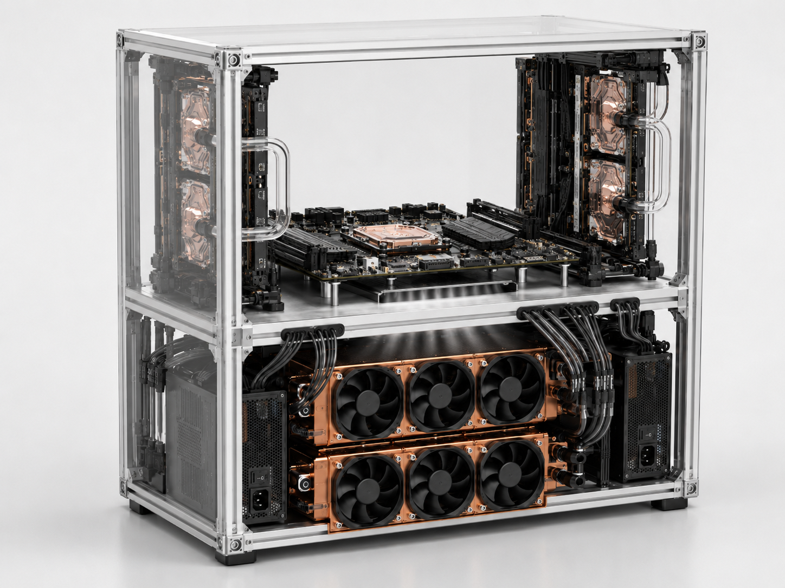
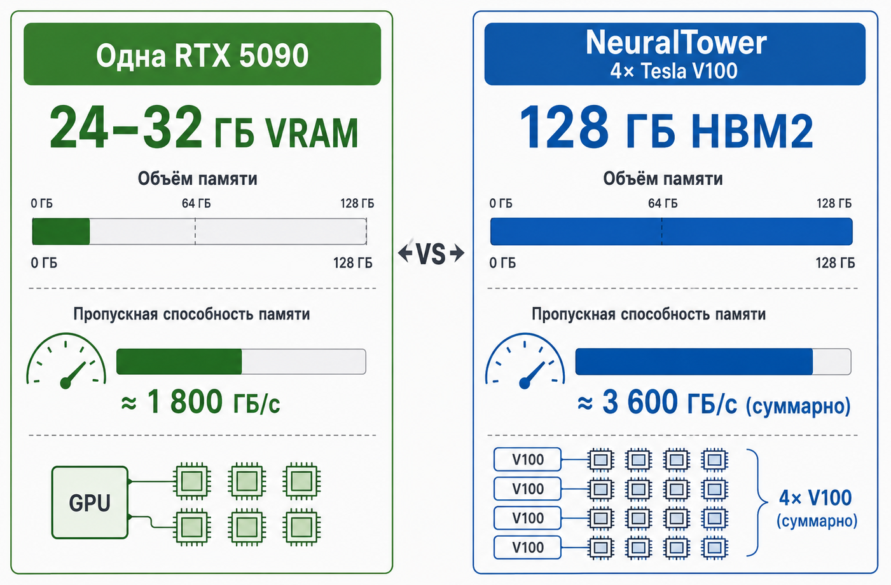
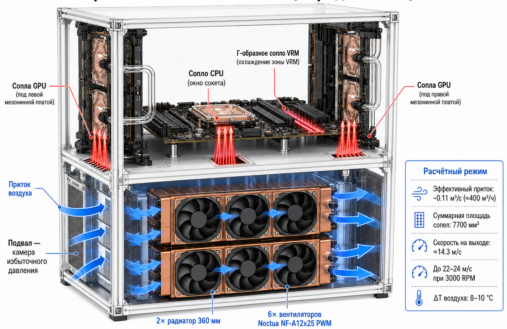
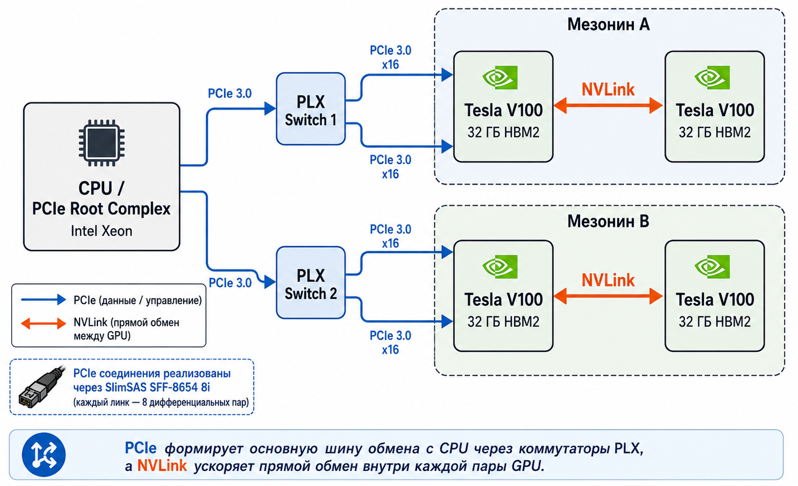

# NeuralTower: проектирование настольного вычислительного узла на базе четырех Tesla V100

> Важное уточнение: проект [NeuralTower](https://github.com/momentics/NeuralTower/) прошел стадию Proof of Concept: стенд из двух GPU V100 SXM2 32 ГБ успешно собран и протестирован, что подтвердило работоспособность цепочки PCIe-SlimSAS-GPU и базовую способность платформы запускать модели класса 27B. Полноценная сборка на четырех GPU с жидкостным охлаждением V-CORE находится в стадии подготовки. Изображения в статье - это концептуальные визуализации по разработанной документации.

---

## Рекламная вставка статьи

> Если запускать нейросети локально, рука почти сама тянется к игровым видеокартам. Ну а что ещё? Про них полно мануалов, драйверы уже обкатаны, чужих сборок в сети море, и карты можно купить. Но лишь берёшь модель посерьёзнее, или пытаешься нормально погонять на большом датасете FineTuning, то всё! — опять всё упирается не в "быстрее бы считало", а в память. Это становится дефицитом. Даже у дорогих видеокарт её хватает не так часто, как хотелось бы.

> Речь пойдет не только о видеокартах. Придется пройти через проектирование рамы из алюминиевого профиля, расчёты "воздушных ножей" в герметичной палубе, силовую часть, трассировку SlimSAS и программную оптимизацию vLLM под сверхдлинные контексты.

> Это проект о том, как полтора киловатта тепла на рабочем столе, можно попытаться превратить не в маленькую серверную стойку, а в управляемый инструмент исследователя.

---

Если запускать нейросети локально, рука почти сама тянется к игровым видеокартам. Ну а что ещё? Про них полно мануалов, драйверы уже обкатаны, чужих сборок в сети море, и эти карты можно купить. Но берёшь LLM посерьёзнее, или пытаешься нормально погонять на большом датасете, то всё! Всё опять упирается не в "быстрее бы считало", а в память. VRAM становится дефицитом. Даже у дорогих видеокарт её хватает не так часто, как хотелось бы.

Именно это заставило меня посмотреть в сторону вторичного рынка профессионального серверного оборудования, так как оно сейчас снимается с оборота и имеет сносную цену. V100 SXM2 там выглядят особенно интересно: по соотношению цены и характеристик они всё ещё способны конкурировать с более новыми решениями, а если задача не только в "сыром" маркетинговом TPS/FPS, то даже где-то выстрелить.

Главная ценность проекта - не сами видеокарты как таковые. Смысл проекта в том, чтобы получить 128 ГБ сверхбыстрой памяти прямо на рабочем столе. А с 128 ГБ уже можно смотреть в сторону моделей, которые в обычный домашний компьютер просто не влезают.

Конечно, радость быстро заканчивается, когда вспоминаешь, откуда это железо. Оно не для дома. Оно для стойки, где дуют турбины, всё гудит, горячий воздух улетает куда-то в канал, и никому нет дела, насколько это неприятно на слух. Поставить такое дома «как есть» не выйдет. Будет шум, жар и питание с аппетитом какого-то небольшого цехового станка, а не рабочей станции.

NeuralTower возник не из желания сделать нестандартный корпус с прозрачными моддинговыми стенками. Скорее наоборот: обычная схема системника тут мешает. Четыре серверные карты, вода, кабели, питание, почти полтора киловатта тепла - всё это нельзя просто сложить в коробку и надеяться, что как-нибудь продуется. Поэтому появилась инженерная идея, которую я назвал V-Core - это поставить вычислительное ядро вертикально и закрыть его в отдельном жёстком объёме. А корпус разрезать палубой на два этажа. Снизу - давление, радиаторы и воздух. Сверху - железо, которое надо дополнительно охлаждать. Уже не "куда попадёт", а по месту.

Нижняя часть корпуса служит воздушным нагнетателем. В ней размещены два крупных медных радиатора и шесть вентиляторов, которые постоянно создают избыточное давление. Этот воздушный нагнетатель используется не для дальнейшего перемешивания воздуха, а для точечного охлаждения зон, которые не закрываются жидкостным контуром.

В разделительной перегородке, которую я называю палубой, прорезаны узкие сопла, или воздушные ножи. Из-за повышенного давления в нижнем отсеке воздух выходит через эти щели, по расчётам, со скоростью свыше 15 м/с.

Эти струи должны попадать именно в радиаторы цепей VRM для GPU и мезонинов и самой материнской платы, включая чипы PLX.

Такая схема должна дать выигрыш по шуму. Вместо серверных турбин на 10 тысяч оборотов, охлаждение обеспечивается водянкой и воздухом. Все расположено в нижнем отсеке.

Отдельной задачей стала передача данных. Чтобы материнская плата могла полноценно общаться с четырьмя мезонинами, используется восемь шлейфов 8i PCIe x8. В обычном корпусе трассировка такого количества жёстких кабелей быстро превратилась бы в клубок, который перекрывает воздух и мешает обслуживанию.

В проекте кабели уходят под палубу. Шлейфы выходят из мезонинов, ныряют в нижний отсек, делают там плавную петлю и возвращаются в адаптеры на плате.

В итоге сверху не получается каша из кабелей. Ну, по крайней мере такая идея. SlimSAS уходят вниз, не висят поперёк всего отсека и не мешают воздуху дуть туда, куда надо.

С питанием там тоже не "воткнул два БП и забыл". Два Corsair могут иметь разницу потенциалов по земле, и можно долго искать, почему на кабелях PCIe начинаются ошибки. Поэтому профиль 20x20 тут не просто рама, на которой всё держится. Он ещё и общая железная земля. Грубо, но полезно. Хорошо бы, конечно, соединить их медной шиной. Но сверление Corsair приведет к потере гарантии.

## Софт под проект

Железо это только фундамент. Дальше идет программная часть, где главная задача не просто использовать, а эффективно использовать все 128 ГБ видеопамяти. В качестве базового движка для инференса я использую vLLM, но в проекте он рассматривается как компонент, который требует доработки под конкретную конфигурацию. Возможно даже он будет заменен на llama.cpp.

Есть еще один момент, о котором хотелось бы рассказать. Полученные 128 ГБ вроде много, но это пока не начинаешь играться с длинным контекстом. KV-кэш пухнет, место кончается, и вся красивая схема снова упирается в память. Поэтому был добавлен vLLM SWAP на NVMe PCIe x4. Часть кэша, которая прямо сейчас не нужна, можно временно вытеснить на диск. Да, это костыль. Диск не превращается в VRAM и чудес не будет. Будут задержки. Но если цель протащить большой контекст, а не поставить рекорд по TPS, такой костыль уже не выглядит глупым.

Ну и, чтобы система могла работать долго, а так же выдерживала подобную нагрузку, нужен нормальный контур наблюдения. В проекте подсистема мониторинга интегрируется с драйверами NVIDIA и датчиками материнской платы. Она отслеживает температуру чипов, энергопотребление каждого мезонина и эффективность работы воздушных ножей.

## Что дальше?

Сейчас NeuralTower - это не готовый образец, а инженерный проект, прошедший проверку концепции. Proof of Concept на двух GPU V100 SXM2 32 ГБ успешно подтвердил работоспособность цепочки PCIe-SlimSAS-GPU и способность платформы запускать модели класса 27B на скорости 32,69 токена в секунду. Поэтому в статье используются рендеры и схемы, а не фотографии готового узла: полноценная сборка на четырех GPU с жидкостным охлаждением ещё впереди.

Дальше надо уже не концентрироваться на общей документации, а разбирать её на куски, которые можно проверить руками. Палуба - какая у неё точная геометрия. Мезонины - куда они реально встанут и на чём будут держаться. SlimSAS - где пройдут шлейфы, чтобы не упереться в стенку и не перекрыть воздух. Блоки питания, контур воды, зазоры под воздушные ножи - всё это пока надо довести из "вроде сходится" до нормальных размеров и посадочных мест. А уже после этого можно отдельно идти по железу: рама, резка палубы, сборка СЖО, электрика и первые прогоны.

Для меня эта статья - фиксация исходной инженерной гипотезы можно ли превратить серверную связку из четырёх Tesla V100 в настольный вычислительный узел и не получить при этом шумную, горячую, неудобную стойку в миниатюре? Proof of Concept дал положительный ответ на базовую часть вопроса: данные доходят, GPU инициализируются, инференс работает. Дальше дело - в инженерной доводке полной конфигурации. Часть оборудования и материалов ожидает своих поставок.
